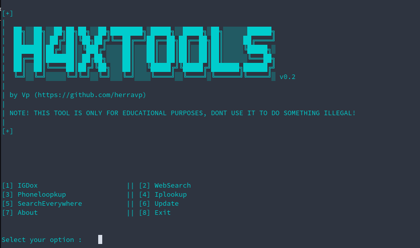

# H4XTools

Multiple useful tools in one program.

More tools coming when I have time to make em.

## Current tools
>IgDox || Scrapes information from IG accounts.

>WebSearch || Searches the web using duckduckgo for a given query.

>Phonelookup || Looks up a phone number and returns information about it.

>Iplookup || Looks up an IP address and returns information about it.

>IpScanner || Scans an website for IP addresses.

>UsernameSearch || Tries to find a given username from websites like Steam and TikTok.

>RealnameSearch || Tries to find a given name from websites like Facebook and Linkedin.

>WebhookSpammer || Spams messages to a discord webhook.

>WhoIs || Looks up a domain and returns information about it.

>Update || Updates the tool if new versions are available.

>About || Tells you about the tool.

>Exit || Exits the tool.

## Setup
This tool is designed for Linux users, but it should work fine on Windows too.

### Windows
1. Make sure you have [python](https://www.python.org/downloads/) installed.

2. Download H4XTools from the [releases](https://github.com/HerraVp/H4X-Tools/releases) section.

3. Run the setup.bat file.

### Linux
1. Clone the repo `git clone https://github.com/HerraVp/H4X-Tools.git`

2. Run `sh setup.sh` in terminal to install the tool.

To update the tool, run `sh update.sh` if you are on Linux.

If you are on Windows, run the program as usual and run the update option.

### Only tested on Fedora 35 and Windows 10
But it should work fine on other Linux distros and Windows 11 too.

If it doesnt work, install the dependencies manually and start the application in terminal using `python3 h4xtools.py`.

-------------------------------------------
-------------------------------------------
THIS TOOL IS ONLY FOR EDUCATIONAL PURPOSES, DONT USE IT TO DO SOMETHING ILLEGAL!
